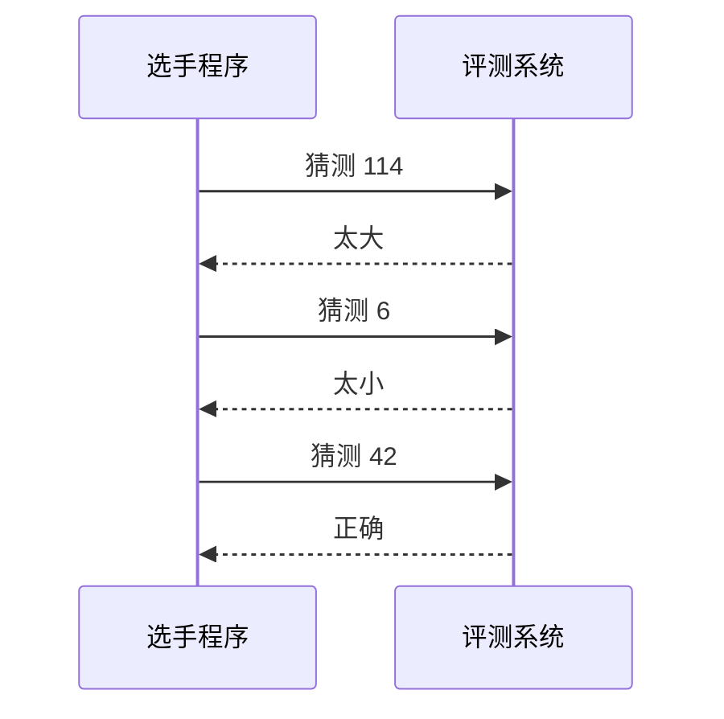
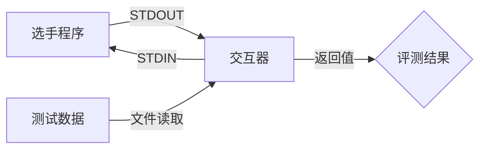

# 交互题 (Interaction) {#interaction}

交互题是一种特殊的编程题型，要求选手编写的程序与评测系统进行动态交互。与传统编程题（只需读取输入并输出结果）不同，交互题需要程序在运行过程中与评测系统进行多次双向通信。

## 举个例子 {#example}

考虑经典的猜数字游戏场景：
1. 评测系统随机选定一个目标数字（如 42）
2. 选手程序需要在限定次数内（如 7 次）通过提问猜出该数字
3. 每次猜测后，评测系统会返回以下三种响应之一：
   - 太大（猜测值 > 目标值）
   - 太小（猜测值 < 目标值）
   - 正确（猜测值 = 目标值）



> [!TIP] 相关链接
> - [OI Wiki - 交互题](https://oi-wiki.org/contest/interaction/)
> - [洛谷帮助中心 - 交互题功能说明](https://help.luogu.com.cn/manual/luogu/problem/interactive-problems)

## 交互机制 {#mechanism}

和 ICPC 系列赛事一样，Putong OJ 采用标准输入输出（STDIO）方式进行交互：

- 选手程序往 STDOUT 输出询问给评测系统
- 评测系统的响应通过 STDIN 输入到选手程序

由于输出缓冲机制，必须在每次输出后执行 flush 操作确保及时通信：

| 语言   | 刷新方法                  |
| ------ | ------------------------- |
| C      | `fflush(stdout)`          |
| C++    | `std::cout << std::flush` |
| Java   | `System.out.flush()`      |
| Python | `sys.stdout.flush()`      |

> [!IMPORTANT] 特殊说明
> - C++ 中 `endl` 会自动执行 flush 操作
> - 建议使用更高效的 I/O 方式（如 C++ 的 `scanf`/`printf` 替代 `cin`/`cout`）

## 技术实现 {#implementation}

Putong OJ 在评测交互题时，会同时运行选手程序以及由出题人编写的评测系统（以下具体称为**交互器**）。测试点数据将以文件的形式传递给交互器，选手程序和交互器之间的交互通过标准输入输出进行。

- 选手程序的 STDOUT → 交互器的 STDIN
- 交互器的 STDOUT → 选手程序的 STDIN



题目的时空限制以及测量仅限于选手程序，交互器运行所消耗的资源不会影响评测结果。最终答案正确与否将由交互器的返回值决定：

- Return 0：<span style="color: oklch(63.7% 0.237 25.331)">Accepted</span> 选手程序输出正确；
- Return 1：<span style="color: oklch(72.3% 0.219 149.579)">Wrong Answer</span> 选手程序输出错误；
- Return 2：<span style="color: oklch(68.1% 0.162 75.834)">Presentation Error</span> 选手程序输出格式错误；
- 其它返回值：<span style="color: oklch(72.3% 0.219 149.579)">Runtime Error</span> 各种其它错误（如错误的询问格式）。

如果交互器本身因为各种原因未能退出（如死循环等），将会引发 <span style="color: oklch(72.3% 0.219 149.579)">System Error</span>。

## 交互器的编写 {#writing-interactor}

交互器的编写和普通的 C++ 程序没有太大区别，它的标准输入和标准输出分别对应选手程序的标准输出和标准输入，运行参数中包含了测试点数据文件的路径：

```bash
./interactor.out <Input_File> <_Ignored_> <Answer_File>
```

如果交互器正常运行并退出，交互器会视为选手程序的输出正确；如果交互器产生了非零的返回值，交互器会视为选手程序的输出错误；此外的错误（例如交互器崩溃）会被视为交互器的错误。

Putong OJ 集成了 Codeforces 同款的 Testlib 库，Testlib 库提供了丰富的函数和宏来处理输入输出等操作，交互器可以使用它来简化交互题的编写。

以猜数字为例，交互器的代码如下：

```cpp
#include "testlib.h" // 引入 Testlib 库
#include <iostream>

using namespace std;

int main(int argc, char** argv) {
  registerInteraction(argc, argv); // 注册 Testlib 交互模式

  int n = inf.readInt(); // 读取测试点数据

  int left = 50;                        // 剩余的提问次数
  bool found = false;                   // 是否找到数字
  while (left > 0 && !found) {          // 当还有提问次数且没有找到数字时循环
    left--;                             // 提问次数减一
    int a = ouf.readInt(1, 1000000000); // 读取选手程序的猜测数字
    if (a < n)                          // 如果猜测数字小于测试点的数字
      cout << 0 << endl;                // 输出「太小」
    else if (a > n)                     // 如果猜测数字大于测试点的数字
      cout << 2 << endl;                // 输出「太大」
    else                                // 如果猜测数字等于测试点的数字
      cout << 1 << endl, found = true;  // 输出「正确」并标记为找到数字
    cout.flush();                       // 刷新输出缓冲区
  }

  // 如果 50 次提问后仍然没有找到数字，返回 Wrong Answer
  if (!found) quitf(_wa, "couldn't guess the number with 50 questions");

  // 如果找到了数字，返回 Accepted
  quitf(_ok, "guessed the number with %d questions!", 50 - left);
}
```

> [!TIP] 相关链接
> - [Testlib 代码仓库](https://github.com/MikeMirzayanov/testlib)
> - [OI Wiki - Testlib 简介](https://oi-wiki.org/tools/testlib/)
> - [OI Wiki - Testlib Interactor](https://oi-wiki.org/tools/testlib/interactor/)
> - [Codeforces 交互题指南](https://codeforces.com/blog/entry/45307)
