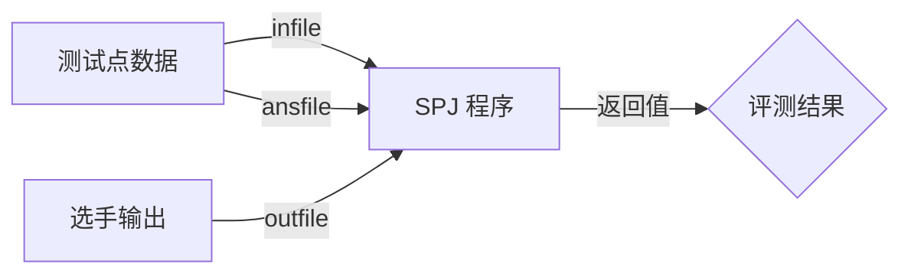

# 特判（Special Judge）{#special-judge}

Special Judge（简称 SPJ）是一种灵活的评测机制，用于处理那些不唯一解或需要特殊判断的编程题目。与传统题目（仅比对固定输出）不同，SPJ 允许通过自定义程序来验证选手答案的正确性。

## 应用场景 {#use-cases}

SPJ 常用于以下情况：

- **多解题目**：问题存在多个正确答案（如某些数学方程的解）；
- **近似判断**：允许答案在一定误差范围内（如浮点数计算）；
- **特殊格式**：输出格式需要特别验证（如特定结构的图形）；
- **最优解验证**：验证答案是否满足最优条件（如最短路径）。

## 技术实现 {#implementation}

Putong OJ 的 SPJ 评测流程由如下几个部分组成：

- **测试点数据**：测试点的 `.in` 和 `.out` 文件（`infile` 和 `ansfile`）；
- **选手输出**：程序运行后生成的结果文件（`outfile`）；
- **SPJ 程序**：读取输入数据和选手输出进行验证的 Checker。



SPJ 程序通过返回值确定评测结果：

- Return 0：<span style="color: oklch(63.7% 0.237 25.331)">Accepted</span> 选手程序输出正确；
- 其它返回值：<span style="color: oklch(72.3% 0.219 149.579)">Wrong Answer</span> 选手程序输出错误。

## SPJ 程序的编写 {#writing-checker}

SPJ 程序通常包含三个主要部分：

1. 读取输入数据（测试点数据）
2. 读取选手输出
3. 验证逻辑

Putong OJ 推荐使用 [Testlib](https://github.com/MikeMirzayanov/testlib) 库编写 SPJ，它提供了丰富的验证函数。

> [!WARNING] 注意事项 
> - **性能要求**：SPJ 应在合理时间内完成验证；
> - **错误处理**：对非法输出应有明确判断（如非数字字符）；
> - **公平性**：验证逻辑应与题目描述完全一致。

以下是一个简单的 SPJ 程序示例，验证测试点答案和选手输出中的整数是否相等：

```cpp
#include "testlib.h"

int main(int argc, char * argv[]) {
    setName("compares two signed integers");
    registerTestlibCmd(argc, argv);
    int ja = ans.readInt();
    int pa = ouf.readInt();
    if (ja != pa)
        quitf(_wa, "expected %d, found %d", ja, pa);
    quitf(_ok, "answer is %d", ja);
}
```

> [!TIP] 相关资源
> - [Testlib 代码仓库](https://github.com/MikeMirzayanov/testlib)
> - [OI Wiki - Special Judge](https://oi-wiki.org/tools/special-judge/)
> - [OI Wiki - Testlib 简介](https://oi-wiki.org/tools/testlib/)
> - [OI Wiki - Testlib Checker](https://oi-wiki.org/tools/testlib/checker/)
